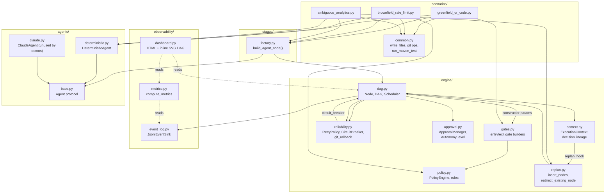
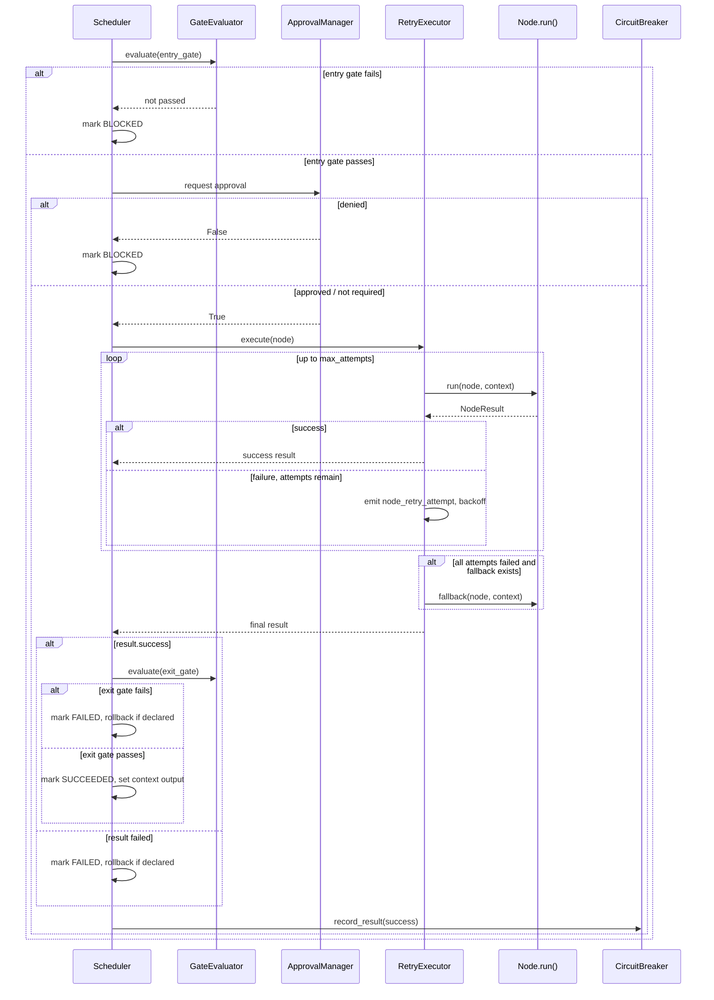
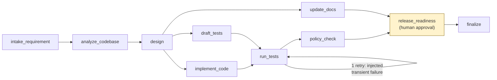
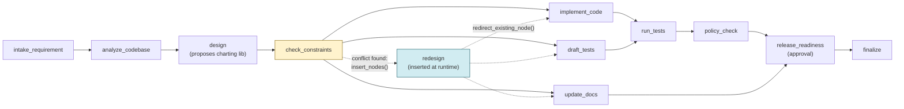

# Architecture

## Component overview

**Why this shape**: the scheduler (`dag.py`) is built around four narrow
extension points — a gate evaluator, a retry executor, an approval manager,
and an event sink — each with a trivial pass-through default. Every other
subsystem (`gates.py`, `reliability.py`, `approval.py`, the observability
package) is a real implementation of one of those extension points, plugged
in via constructor arguments. Nothing about the scheduler's core loop
changed after its first commit; every later phase added a real
implementation for an already-existing seam. That's not incidental — it's
what let each phase land as an independently testable, independently
reviewable commit against the same scheduler its own tests and every later
phase's tests exercise.

## Control flow: one node's execution

## Non-linear execution: the brownfield DAG

This is the shape from the assignment's own "non-linear, stateful
execution" requirement — a join, a genuine fan-out into parallel branches,
a second join, and a human-approval gate before release:

`implement_code`, `draft_tests`, and `update_docs` all become ready in the
same tick once `design` succeeds, and the scheduler runs them concurrently
via `asyncio.gather` — `run_tests` is a real synchronization barrier
(it only becomes ready once *both* parallel branches finish), and
`release_readiness` is a second one (waiting on `policy_check` *and*
`update_docs`).

## Dynamic re-planning: the ambiguous scenario

`check_constraints` sits between `design` and the implementation fan-out
specifically so it resolves *before* `implement_code`/`draft_tests`/
`update_docs` become ready — if it ran in parallel with them (e.g. if it
also just depended on `design`), the replan could lose the race against
work that should have been redirected. When it detects the conflict, it
calls `context.replan()` to insert `redesign` and redirect the three
downstream nodes onto it in addition to their original dependency —
conditional on what `design` actually produced, not scripted to always
fire (a stub design with no conflict produces zero replan activity, which
is what one of the structural tests asserts).

## Observability

Every scheduler event — node start/success/failure/block, retry attempts,
rollbacks, approval requests/decisions, replans — is written as one JSON
line to `runs/<scenario>/events.jsonl` as it happens. `metrics.py` computes
success rate, retry/rollback frequency, MTTR, and per-node/total latency
**entirely from that log**, after the fact — there's no separate runtime
counters that could drift from what the log says happened. `dashboard.html`
renders the executed DAG (topologically layered, colored by final status,
join edges drawn as multi-parent arrows) plus those metrics as stat tiles,
as a single self-contained file — no server, no external JS.

## Reliability controls in one place

| Control | Where | Proven by |
|---|---|---|
| Bounded retries | `reliability.RetryPolicy` + `make_retrying_executor` | `test_reliability.py`; brownfield's real injected-failure run (1 retry, MTTR 10.10s in its actual `SUMMARY.md`) |
| Fallback | `Node.fallback`, run after retries exhaust | `test_reliability.py` |
| Rollback | `Node.rollback`, `reliability.git_rollback` | `test_reliability.py` against a throwaway git repo |
| Safe-stop | `reliability.CircuitBreaker` + `Scheduler._safe_stop` | `test_reliability.py`; deliberately separated into two ticks so the test proves in-flight work isn't retroactively cancelled, only new work is prevented |
| Policy guardrails | `policy.PolicyEngine`, four default rules | `test_policy.py`, including a regression test for a real false-positive found running the ambiguous scenario |
| Human approval | `approval.ApprovalManager`, three autonomy levels | `test_approval.py`; every real scenario run pauses at `release_readiness` |
| Audit trail | `observability.event_log.JsonlEventSink` | Every real run's `events.jsonl` |
| Dynamic re-planning | `engine.replan` + `context.replan_hook` | `test_replan.py`; the ambiguous scenario's real `redesign` node |

## Known limitations (see `FINAL_SUMMARY.md` for the full list)

- Single-machine `asyncio` concurrency, not distributed workers.
- No live LLM calls in any demo run (by explicit choice — see README).
- Rollback is scoped to files a node declares it touched, not a full
  transactional filesystem snapshot.
